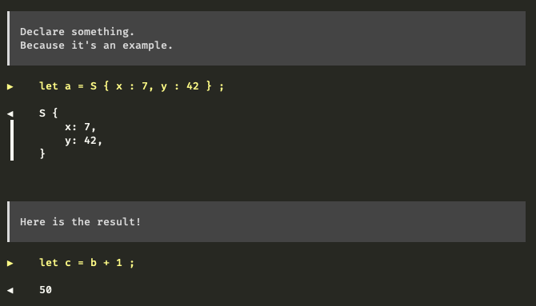

<h1 align="center">
  <br />
  Code Tour
</h1>

## Introduction

This project is an attempt to improve Rust example-based learning
approach.

Imagine the following example file:

```rust
#[derive(Debug)]
struct S {
    x: i32,
    y: i32,
}

fn main() {
    // Declare something.
    // Because it's an example.
    let a = S { x: 7, y: 42 };

    let b = a.x + a.y;

    // Here is the result!
    let c = b + 1;
}
```

When you run the example with `cargo run --example foo`, you'll see
nothing! It means the author of the example must add `println!` or
`dbg!` instructions everytime. And we are going to miss the comments
too.

Enter `code_tour`.

Let's rewrite the example as such:

```rust
use code_tour::code_tour;

#[derive(Debug)]
struct S {
    x: i32,
    y: i32,
}

#[code_tour]
fn main() {
    /// Declare something.
    /// Because it's an example.
    let a = S { x: 7, y: 42 };

    let b = a.x + a.y;

    /// Here is the result!
    let c = b + 1;
}
```

Let's re-execute the example as previously, and we'll see:

```rust
$ cargo run --example foo
```



The example annotations are replicated on the output during the
execution.

An annotation must be a comment of kind `///` or `/** … */` that
introduces a `let` binding. That's all for the moment!

### Interactive mode

Running the example with `--features interactive` will display a
“Press Enter to continue, otherwise Ctrl-C to exit.” message after
each step of your code.

```rust
$ cargo run --example foo --features interactive
```


### Quiet mode

Running the example with the environment variable `CODE_TOUR_QUIET`
set will turn code-tour silent. Note that it won't disable the
interactive mode (which is on purpose).

```rust
$ CODE_TOUR_QUIET=1 cargo run --example foo
```

### Better source code display

Running the example with `cargo +nightly` will generate a better
output for the code, by using
[`Span::source_text`](https://doc.rust-lang.org/proc_macro/struct.Span.html#method.source_text).

```rust
$ cargo +nightly run --example foo
```

## Install

This is a classic Rust project, thus add `code_tour` to your
`Cargo.toml` file, and that's it.

## License

`BSD-3-Clause`, see `LICENSE.md`.
